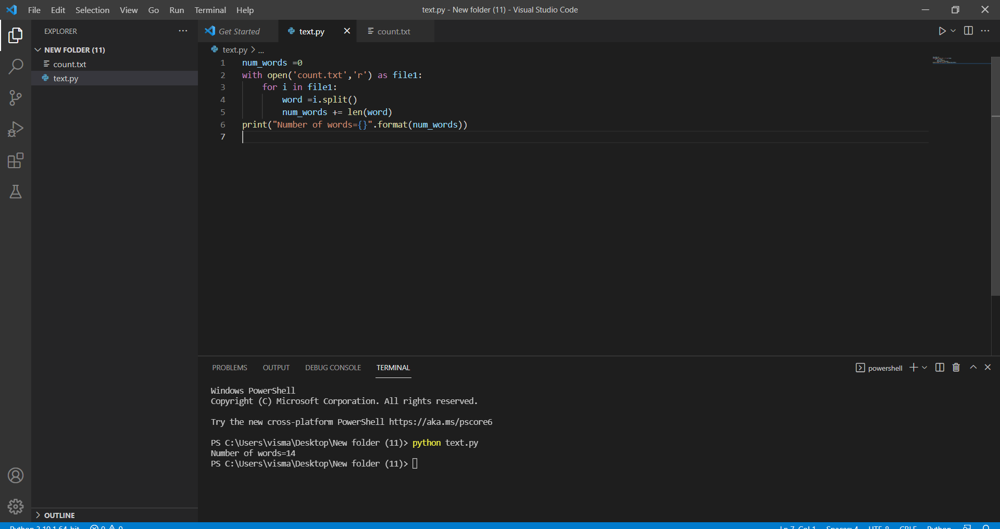
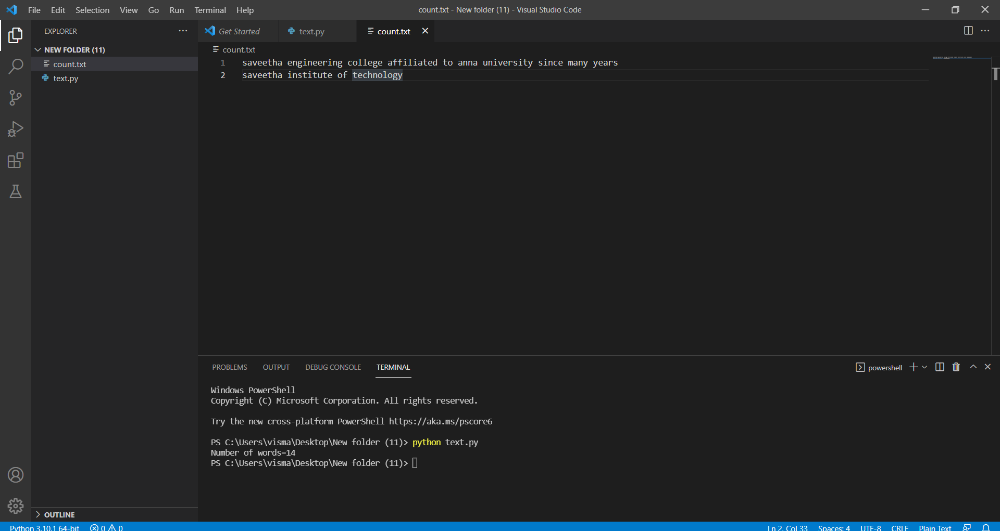

<<<<<<< HEAD
# Word-count
## AIM:
To write a python program for getting the word count from a text.
## EQUIPEMENT'S REQUIRED: 
PC
Anaconda - Python 3.7
## ALGORITHM: 
### Step1:
Start
### Step 2:
Declare a variable count equal to 0.
### Step 3:
Open the required text file in read mode as text.(any name can be used).
### Step 4:
Loop until variable i in file text.
### Step 5:
Declare variable word = i.split().
### Step 6:
Process count+=len(word) End loop
### Step 7:
Print the value of count, which has the number of words in the file
### Step 8:
Stop

## PROGRAM:
~~~
Developed by : S.M.Syed Mokthiyar
refference no: 22006227

num_words =0
with open('text.txt','r') as file1:
    for i in file1:
        word =i.split()
        num_words += len(word)
print("Number of words={}".format(num_words))
~~~

### OUTPUT:

## RESULT:
Thus the program is written to find the word count from a text.
=======
